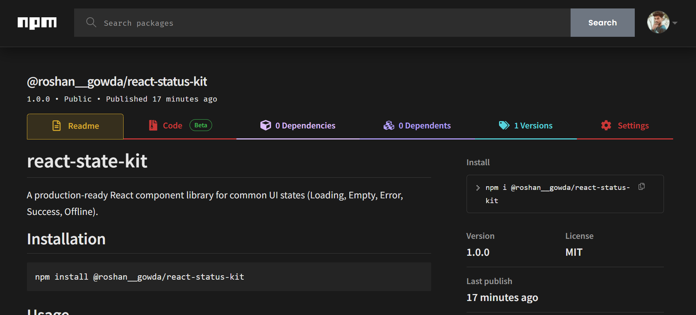

# React State Kit

<p align="center">
  
  
  
  
</p>

<p align="center">
  <strong>A production-ready React component library for beautiful UI states.</strong>
</p>

<p align="center">
  Easily handle <strong>Loading, Empty, Error, Success, and Offline</strong> states with reusable and customizable React components.
</p>

---

## Overview

**React State Kit** is designed to eliminate repetitive UI state code from React applications.

Instead of creating loading spinners, error messages, empty placeholders, and offline screens repeatedly, simply import the components and build cleaner, more maintainable applications.

### Perfect for

* Dashboards
* Admin panels
* SaaS applications
* E-commerce websites
* Portfolio projects
* Production React applications

---

## NPM Package

After publishing the package on npm, it can be installed directly into any React project.

### Published package screenshot


<p align="center">
  
</p>

---

## Installation

```bash
npm install @roshan__gowda/react-status-kit
```

---

## Quick Start

```jsx
import {
  LoadingState,
  EmptyState,
  ErrorState,
  SuccessState,
  OfflineState
} from '@roshan__gowda/react-status-kit';

import '@roshan__gowda/react-status-kit/style.css';

function App() {
  return (
    <>
      <LoadingState message="Loading data..." />
      <EmptyState message="No products found" />
      <ErrorState message="Something went wrong" />
      <SuccessState message="Operation completed successfully" />
      <OfflineState message="You are currently offline" />
    </>
  );
}

export default App;
```

---

## Available Components

| Component      | Description                           |
| -------------- | ------------------------------------- |
| `LoadingState` | Displays an animated loading state    |
| `EmptyState`   | Shows a clean empty placeholder       |
| `ErrorState`   | Displays an error message             |
| `SuccessState` | Displays a success confirmation       |
| `OfflineState` | Indicates network connectivity issues |

### Example

```jsx
<LoadingState message="Fetching users..." />
```

---

## Features

* Lightweight and fast
* Reusable UI state components
* Customizable messages
* Responsive design
* React 18+ compatible
* Easy integration
* Clean and modern UI
* Production-ready package

---

## Project Structure

```text
react-state-kit/
│
├── src/
│   ├── components/
│   │   ├── LoadingState.jsx
│   │   ├── EmptyState.jsx
│   │   ├── ErrorState.jsx
│   │   ├── SuccessState.jsx
│   │   └── OfflineState.jsx
│   ├── styles/
│   └── index.js
├── package.json
└── README.md
```

---

## Why React State Kit?

### Before

```jsx
if (loading) return <Spinner />;
if (error) return <Error />;
if (data.length === 0) return <Empty />;
```

### After

```jsx
if (loading) return <LoadingState />;
if (error) return <ErrorState />;
if (data.length === 0) return <EmptyState />;
```

Cleaner code. Better consistency. Faster development.

---

## Collaborators

This project is actively developed with contributions from:

* **Roshan Gowda** — Creator & Maintainer
* **Swamy V Gowda** — Collaborator

GitHub: **@swamyvgowda-arch**

---

## Contributing

Contributions, issues, and feature requests are welcome.

If you'd like to contribute:

1. Fork the repository
2. Create a feature branch
3. Commit your changes
4. Push to your branch
5. Open a Pull Request

---

## License

This project is licensed under the **MIT License**.

---

<p align="center">
  Made with React and open-source ❤️
</p>
